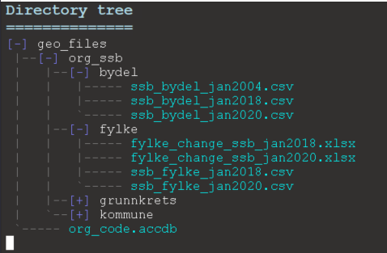

# norgeo

<!-- badges: start -->

<!-- badges: end -->

Regional granularity levels in Norway which are depicted by different
codes, have undergone several changes over the years. Identifying when
codes have changed and how many changes have taken place can be
troublesome. This package will help to identify these changes and when
the changes have taken place. One of the limitation of this package is
that it is heavily depending on the codes available from SSB which can
be accessed from their
[website](https://www.ssb.no/befolkning/artikler-og-publikasjoner/regionale-endringer-2020).
To use other data than the data structure should mimic those from SSB.

## Installation

`norgeo` package can be installed directly from **GitHub** page of
[Folkehelseprofil](https://github.com/folkehelseprofil). You can run the
code below for installation. It will use `remotes` package to access to
the **GitHub**. If you haven’t installed it before, the package will be
installed automatically prior to installing `norgeo`.

``` r
if(!require(remotes)) install.packages("remotes")
remotes::install_github("folkehelseprofil/norgeo")
```

## Track code changes

You have to download the files from SSB and save it as a `csv` file. For
the code changes, they have to be copied and pasted into an Excel file.
These code changes can be found under *Endringer* tab in the website.
It’s advisable to name the file with a specific word to differentiate
the file from the `csv` files. I would recommed to add the word
`change`. For example `fylke_change_jan2018.xlsx` and the downloaded
`csv` file will be `fylke_jan2018.csv`. It’s also advisable to add the
year to all files to easily differentiate them when running the code.
Check the suggested structure [here](#file-structure) for naming files.

### Add changes

The `geo_set()` function is the most important function to start with.
This function will create an object that is easily used by other
available functions in `norgeo`. This is where raw data in `csv` and
`xlsx` formats will be merged. Additional information will also be
added. The codes below show how the function is used:

``` r
## specify the folder where kommune files are
folder <- "F:/org/kommune"

kom2018 <- geo_set(grep.file = "jan2018",
                   grep.change = "change",
                   year = 2018,
                   type = "kommune",
                   folder.path = folder)

kom2019 <- geo_set(grep.file = "jan2019",
                   grep.change = "change",
                   year = 2019,
                   type = "kommune",
                   folder.path = folder)

kom2020 <- geo_set(grep.file = "jan2020",
                   grep.change = "change",
                   year = 2020,
                   type = "kommune",
                   folder.path = folder)
```

### Merge changes

To merge all these files into a big dataset, use `geo_merge()` function.
Important to note that input for `geo_merge()` must be a **list** and
they are arranged from oldest to most recent codes. Available output
includes:

  - `all` : All merged codes. This is the default
  - `change` : Only codes that have changed
  - `split` : Codes that have been divided to at least two codes in the
    current list
  - `merge` : At least two codes are merged into one in the current list

<!-- end list -->

``` r

komfiles <- list(kom2018, kom2019, kom2020)
DF <- geo_merge(files = komfiles)

# show only codes that have changed
DFS <- geo_merge(files = komfiles, output = "split")
```

### Save codes

The output created from `geo_merge()` i.e `DF`, can be saved in a
database management system (DBMS) which include Access and SQLite, or as
ordinary files such as Excel or text file.

``` r
fpath = "C:/Users/ybka/dbms"

geo_save(tblname = "tblTest",
         obj = DF,
         des.path = fpath,
         file.type = "Excel")
```

## Add granularity

The function `geo_cast()` will add lower granularity to all files when
applicable. It means for *kommune* files, a new `fylke` column will be
added, while column `fylke` and `kommune` will be added to a *bydel* and
*grunnkrets* files.

``` r

## Geo 2019
file2019 <- c("F:/Geo/fylke/fylke_jan2019.csv",
              "F:/Geo/kommune/kommune_jan2019.csv",
              "F:/Geo/bydel/bydel_jan2019.csv",
              "F:/Geo/grunnkrets/grunnkrets_jan2019.csv")

fileTyp2019 <- c("fylke", "kommune", "bydel", "grunnkrets")


DF2019 <- geo_cast(file = file2019,
                   type = fileTyp2019,
                   year = 2019)

## Geo 2020
file2020 <- c("F:/Geo/fylke/fylke_jan2020.csv",
              "F:/Geo/kommune/kommune_jan2020.csv",
              "F:/Geo/bydel/bydel_jan2020.csv",
              "F:/Geo/grunnkrets/grunnkrets_jan2020.csv")

fileTyp2020 <- c("fylke", "kommune", "bydel", "grunnkrets")


DF2020 <- geo_cast(file = file2020,
                   type = fileTyp2020,
                   year = 2020)
```

Running `geo_cast()` will also add a new row for granularity `land`
which has code `0`. The output from the above example can then be merged
to a file and saved to the file type one wishes. To bind all the output,
you can use the base R `rbind()` function or `rbindlist()` function from
`data.table` package.

``` r

bigDF <- rbind(DF2019, DF2020)
```

To save the final result, `geo_save()` function can be used as explained
above. Database file must be available prior to saving it as a database
table. In the example below it’s `geo_ssb.accdb`.

``` r
dbpath = "C:/Users/ybka/dbms"
dbname = "geo_ssb.accdb"

geo_save(tblname = "tblGeo",
         obj = bigDF,
         des.path = dbpath,
         file.type = "Access",
         db.name = dbname)
```

## Change codes

The steps above depends on two type of data ie. current valid codes
which is in a `csv` format and codes that have changed in a `xlsx`
format. When table for code changes isn’t available, we have to create
one to be able to use the `geo_set()` function. For example granularity
*bydel* has no table of code change in SSB website.

To create the table from the available `csv` files, we have to decide a
reference column other than geo code such as `names`. Therefore this
function should be used with caution. The output can be saved as `xlsx`
or `csv`.

``` r
files = c("ssb_bydel_jan2004.csv",
          "ssb_bydel_jan2018.csv",
          "ssb_bydel_jan2020.csv")
years = c(2004, 2018, 2020)
folder = "C:/geo/bydel"
des = "C:/geo/bydel/output"

geo_change(files = files,
           years = years,
           type = "bydel",
           key.col = "name"
           folder.path = folder,
           file.type = "Excel",
           des.path = des)
```

## File structure

I would suggest to structure your files in different folders as show
below:


